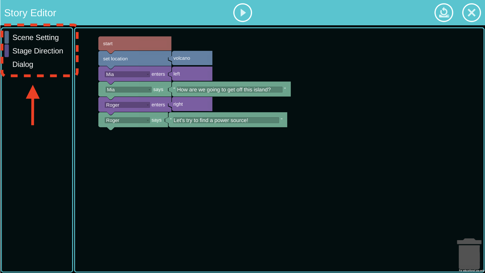

class: title-slide, inverse, center, top
```{r setup, include=FALSE}
knitr::opts_chunk$set(echo = FALSE)
```
```{r, echo=FALSE}
# then load all the relevant packages
pacman::p_load(pacman, tidyverse, tidytext, wordcloud2, readxl, 
               forcats, remotes, ggplot2, rtweet, htmlwidgets, 
               vader, webshot, ggcats, Hmisc, kableExtra)
```

```{r xaringan-panelset, echo=FALSE}
xaringanExtra::use_panelset()
```
```{r xaringanExtra-clipboard, echo=FALSE}
htmltools::tagList(
  xaringanExtra::use_clipboard(
    button_text = "<i class=\"fa fa-clipboard\"></i>",
    success_text = "<i class=\"fa fa-check\" style=\"color: #90BE6D\"></i>",
  ),
  rmarkdown::html_dependency_font_awesome()
)
```

background-image: url(img/wested-vector-logo.png), url(img/ncstate-brick-2x1-red.png),  url(img/CEI_logo_Transparent_Dark3-1024x512.png)
background-position: 5% 99%, 53% 90%, 95% 95%  
background-size: 25%, 20%, 20%

# `r rmarkdown::metadata$title`
----
### Jennifer Houchins, Kimkinyona Cully\*, Danielle Cadieux Boulden, Kevin Oliver, Andy Smith, James Minogue, Bradford Mott, Rasha Elsayed\*, Aleata Hubbard Cheuoua\*, Cathy Ringstaff\*
<br/>
### North Carolina State University
### WestEd\*
### `r format(Sys.time(), "%B %d, %Y")`

---

# Agenda
.font130[- Intro
- Study Design and Context
- Participants
- Methods
- Results
 * Facilitating Story Creation
 * Usability
 * Content Integration
- Conclusions
]
---

# Introduction
<br/>
.font130[
- Although .red[**K-5 teachers are uniquely positioned to integrate CT across the multiple disciplines**] they teach, little is known about learning technologies and in-platform supports that could facilitate their integration efforts (Kale et al., 2018; Pila et al., 2019).

- Our team is iteratively developing a .red[**narrative-centered digital learning environment**] to explore computationally-rich science learning for upper elementary students. 

- Digital narrative creation allows students to explore scientific phenonomena (Henriksen et al., 2016), while reflecting on CT concepts throughout the story creation process (Lee et al., 2014).
]
---

# Study Design and Context
.font130[
We used a .red[**60 minute focus group**], held virtually via Zoom, to gather feedback from elementary teachers about the .red[**design our learning platform**] and its .red[**usability**] for classroom and distance learning settings.

Our study aimed to .red[**examine teachers’ perspectives**] on the environment’s custom narrative blocks and its .red[**integration of science, English language arts, and computational thinking**]. To this end, we framed our study with the following research questions:]
.warmyellow[<b>
1. How do teachers perceive that the learning environment facilitates story creation with narrative blocks?

2. How usable do teachers perceive the learning environment to be? What supports or additional features do teachers feel are needed in the learning environment?

3. How does the learning environment content integration differ from teachers’ instructional practices in science? English language arts? Computational thinking?
<b/>]

---

# Focus Group Participants

.pull-left[
<br/>

]

.pull-right[
.font120[
<b>Setting:</b>
- Interactive video conference in Fall 2020, including 2 breakout rooms

<b>Participants:</b>
- 4 Fourth grade teachers 
 * 3 female, 1 male
- 75% of teachers cover physical science, coding activities in their classes
- All teachers from Northern CA
]]

---
# Methods
.font130[
- Our .red[**focus group protocol had three parts**]:
 1. an introduction to the study and learning environment
 2. teacher experimentation with the learning environment
 3. post-experimentation focus group interview
 
- Rapport was established via an icebreaker activity

- .red[**Teachers were randomly assigned**] to breakout rooms for the .red[**think-aloud activity**] and .red[**environment experimentation**] 

- .red[**All teachers**] came back to the main session after the think-aloud and were asked to .red[**share their perspectives via open ended questions**]
]
---
# Breakout Session - Narrative Planning
.pull-left[<br/>
<br/><br/><br/>
.font130[Teachers initially spent some time .red[**planning their digital narratives**] using a planning document shown here.]

.font130[This phase of the study activity's breakout session lasted .red[**10 minutes**].]
]

.pull-right[

]

---

# Breakout Session - Environment Experimentation

.font130[Teachers then spent the next .red[**20 mins experimenting with the environment**] and .red[**developing their digital narratives**].]

.pull-left[
### Narrative Designer
]

.pull-right[
### Animation
 
]

---
class: clear

background-image: url(img/animation1.png)
background-size: cover

---
#Results
.font130[Our team .red[**qualitatively coded the transcribed audio**] from the think-aloud environment experimentation and the focus group interview questions using .red[**three overarching themes**] aligned to our research questions:]
<br/><br/><br/>
--
<br/>
.center[.font150[.warmyellow[**Facilitating Story Creation**]]]
<br/>
--
<br/>
.center[.font150[.warmyellow[**Usability**]]]
<br/>
--
<br/>
.center[.font150[.warmyellow[**Content Integration**]]]
<br/>
---

# Facilitating Story Creation
<br/>
.font130[Custom narrative-blocks aided teachers’ digital story development.]

.font130[Even though unfamiliar with the environment, encountering the custom narrative blocks spurred the creation of their narratives.]

.font110[.center[.red[*<b>“So, location. So, do we want to be at the beach or waterfall?”</b>*]]]

.font130[Character- and dialog- focused blocks were perceived as intuitive and teachers spent much of their time on building character dialogs.]

.font110[.center[.red[*<b>“So now we have all of our people and then Hailey says, ‘They arrive at the waterfall, right?’ Because they're just walking at the waterfall and they arrive at the waterfall and what is Hailey saying.”</b>*]]]

---

# Facilitating Story Creation (cont)
<br/>
.font130[Teachers also incorporated elements of problem-solving into their narratives.]

.font110[.center[.red[*<b>“So, we have a shelter and a water source, but we need a power source. A question for the audience might be, how do we get our power source?”</b>*]]]

.font130[Mismatches between teacher expectations and character appearance was a point of contention.]

.font130[Teachers expressed timing as key element to classroom use of the environment.]

.font110[.center[.red[*<b>“I think you'd have them work in teams and plan out the story? And they'd have to get some ideas, I think. So, you'd have to brainstorm, like she said and I'd see this being at least [a] week too and using a lot of language arts time before they dive into it. What a story should look like even.”</b>*]]]

---
# Usability of the Learning Environment
<br/>
.font200[.warmyellow[
.center[<i class="fas fa-star" ></i> &nbsp; <i class="fas fa-star"></i> &nbsp; <i class="fas fa-star"></i> &nbsp; <i class="fas fa-star"></i>]
]]
<br/>
.font150[**Teachers found the platform .red[intuitive] and .red[engaging].**]

.font130[.pull-left[
- Learning environment operated according to design

- Environment engaging and easy to use
]
.pull-right[
- No issues with narrative block access

- No issues with dragging and attachment features

]]
---
# Usability of the Learning Environment (cont)
<br/>
.font130[
- Teachers .red[**intuitively and cooperatively used**] the block-based programming interface

 - .red[**Created roles**] for each named character
 
 - .red[**Planned out story**] using worksheet ‘dialog’ and ‘ask the  audience a question’ format
 
 - Used left hand navigation categories and naming of custom narrative blocks to identify story creation components
 
- Half of teachers, using platform visualization system, .red[**easily translated story into visual form**]
]
---
# Usability Difficulties

.pull-left[
.font130[
- Teachers had .red[**difficulties navigating the planning worksheet**]
 - Did not understand interactive theatre aspect
 - Editing the block in the question space of planning worksheet
- Teachers .red[**did not initially understand**] how to use .red[**the learning environment**]
 - Did not understand how to get started, close/exit the block categories
- One teacher had platform access issues because access to our platform was not available on an iPad
]]
.pull-right[
<br/><br/>
]

---

class: inverse, middle, center, clear

.center[.font150[**However, with .red[minimal researcher feedback and/or additional time], in all cases, teachers .red[overcame each source of difficulty] without further assistance.**]]
<br /><br />

.pull-left[ ]
.pull-right[]


---

# Content Integration

## .red[**ELA**]
.font130[
- Dedicated instructional time for students to write and build stories; ideal for playwriting
] 

## .red[**Science**]
.font130[
- Components within the system could be leveraged as sources of energy (e.g., waterfalls, wind)
- Scaffold ideation through whole-class brainstorming
]

## .red[**CT**]
.font130[
- CT behaviors observed by researchers
- Connections will need to be explicitly fostered through professional development
]

---
# Conclusions and Recommendations
<br/>
.font130[
- Our narrative-centered offers .red[**great potential for engaging ELA, science, and CT learning**]

- We are iteratively refining with .red[**additional navigation and instructional supports**] as we garner feedback from teachers and students
 - .red[**Science Content Explorer**] application
 
 - Design .red[**PD around CT concepts**] and how to teach them to students through the .red[**affordances of InfuseCS**] 
]
---

class: inverse, clear, center

## .font170[.center[**Thank you!**]]
<br/>

.left-col[
.center[<br/>.font120[**Jennifer Houchins**<br/><mailto:jennifer.houchins@ncsu.edu>]]
]
.center-col[
.center[<br/>.font120[**Kimkinyona Cully**<br/><mailto:kcully@wested.org>]]
]
.right-col[
.center[<br/>.font120[**Danielle Cadieux Boulden**<br/><mailto:dmboulde@ncsu.edu>]]
]
<br/><br/><br/><br/><br/><br/><br/><br/><br/>

.pull-left-narrow[<br/>.center[]]

.pull-right-wide[
.left[
**This research was supported by the National Science Foundation through grants DRL-1921495 and DRL-1921503. Any opinions, findings, and conclusions expressed in this material are those of the authors and do not necessarily reflect the views of the National Science Foundation.**
]
]

